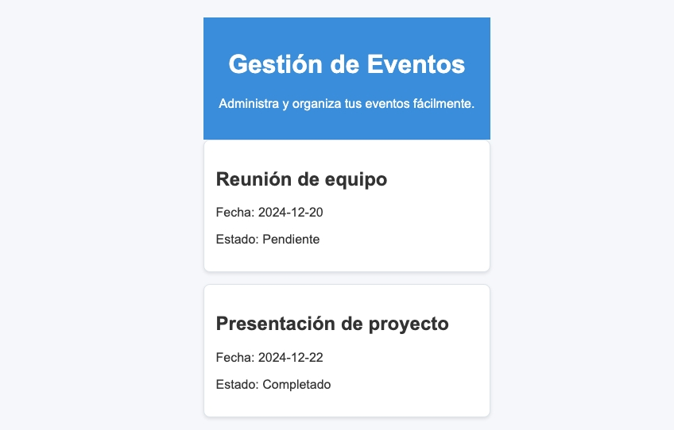

# Event Manager

Este proyecto es un sistema de gestión de eventos, Esta divididi en dos partes.

1. **event-manager-server**: un pequeño servidor usa Socket.IO para comunicarse con los clientes.
2. **event-manager-app**: una aplicación web que se comunica con el servidor y en la cual se desarrollara gran parte de la actividad de las clases.

## Visuales



## Estructura del proyecto

```bash
event-manager
├── eslint.config.js
├── index.html
├── package-lock.json
├── package.json
├── public
│   └── vite.svg
├── src
│   ├── App.css
│   ├── App.jsx
│   ├── assets
│   │   └── react.svg
│   ├── components
│   │   ├── EventCard.jsx
│   │   ├── EventList.jsx
│   │   └── Header.jsx
│   └── main.jsx
└── vite.config.js
```

## Requisitos

- Node.js
- npm
- git

## Instalación

1. Clonar el repositorio

```bash
git clone git@github.com:adalid-cl/event-manager.git
```

2. Instalar las dependencias del servidor

```bash
cd event-manager-server
npm install
```

3. Instalar las dependencias de la aplicación

```bash
cd event-manager-app
npm install
```

## Ejecución

1. Iniciar el servidor

```bash
cd event-manager-server
node server.js
```

2. Iniciar la aplicación

```bash
cd event-manager-app
npm start
```

## Soporte

Si tienes problemas, abre un issue en el repositorio: [Issues](https://github.com/adalid-cl/ESPECIALIZACION_FRONTEND_M4_AE2/issues).

Con ❤️ por [Adalid CL](https://github.com/adalid-cl) 😊
